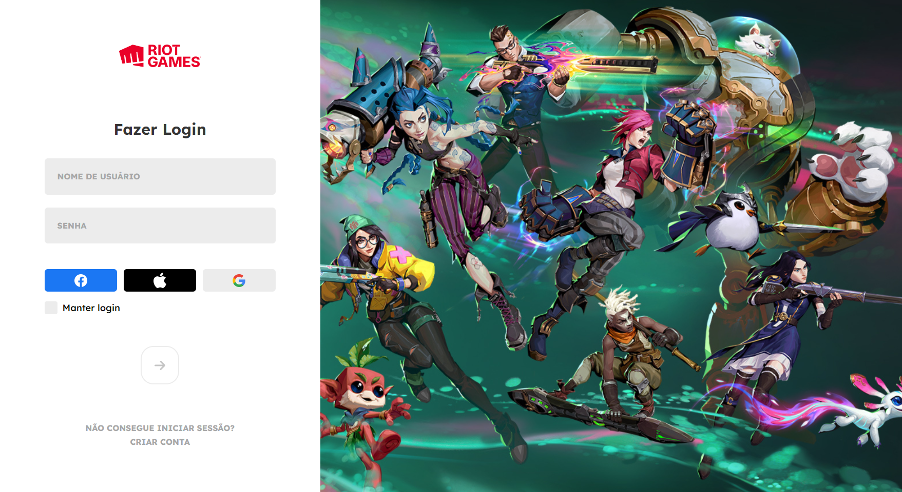

<h1 align="center">
     📰
CLONE RIOT GAMES LOGIN

</h1>

<h5 align="center">
  Pagina inicial da riot games account
 </h5>

 
 

## 💻 Tecnologias utilizadas

Para o desenvolvimento deste site utilizei as seguintes tecnologias:

 * Visual Studio Code (Editor de código);

* HTML;

* JavaScript

* CSS;

## Github Pages:

https://felipefullstacker.github.io/Riot-Login-Clone/
